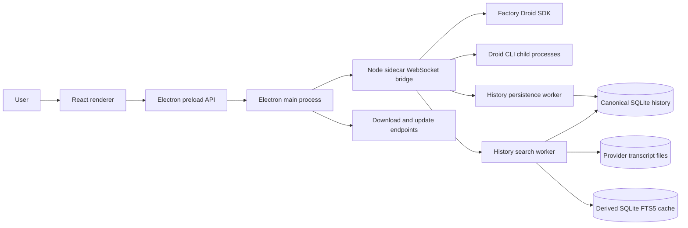

# Architecture

DROIDEX is split into three runtime surfaces: the React renderer, the Electron host, and the Node sidecar. Dedicated Node worker threads isolate high-frequency history persistence, provider-file reconciliation, transcript parsing, and full-text indexing from agent orchestration.

## Runtime flow

## Components

| Area | Path | Responsibility |
| --- | --- | --- |
| Renderer | `src/` | React UI, local state, settings, onboarding, session and Mission Control views |
| Electron main | `electron/main.cjs` | Window lifecycle, bridge process management, native browser lifecycle, downloads, update checks |
| Electron preload | `electron/preload.cjs` | Narrow API boundary between renderer and Electron main process |
| Native browser preload | `electron/nativeBrowserPreload.cjs` | Browser automation bridge for embedded native browser flows |
| Sidecar | `sidecar/src/` | Local WebSocket bridge, Droid SDK session lifecycle, Mission Control integration, CLI discovery |
| History worker threads | `sidecar/src/historyPersistenceWorker.ts` | Independently supervised writer and index workers for batched durability, file reconciliation, transcript extraction, and SQLite FTS away from the sidecar event loop |

## Data and control boundaries

- The renderer does not call the Droid SDK directly. It communicates through preload APIs and the sidecar bridge.
- The Electron main process owns local process lifecycle and injects bridge configuration into the sidecar.
- The sidecar owns Droid SDK calls and child process environment shaping. It removes `FACTORY_API_KEY` unless a key is explicitly configured.
- Live canonical session state stays in the sidecar. A bounded write-behind queue sends lossless event rows and latest-wins summary/child snapshots to the history worker in ordered transactions.
- Packaged builds require a bridge token. Development builds may allow local no-token access with `BRIDGE_ALLOW_LOCAL_NO_TOKEN=1`.

### Sidecar session core

- `appSessionId` is the stable top-level application identity. `childSessionId` is the stable logical child identity within its `parentAppSessionId`; `providerSessionId` is reserved for the backing Factory session.
- `SessionManager` is the composition root and public command coordinator. It retains public dispatch, cross-module routing, and shutdown ordering.
- `FactoryRuntime` is the narrow SDK seam; `DroidRuntime` is its production adapter.
- `SessionRegistry` owns top-level sessions only: the live parent map, stable application identity, provider aliases, canonical parent summary persistence, and projected summary reads. Children never enter `SessionRegistry` or `sessions.list`.
- Ordinary chats enter durable `sessions.list` history only after the provider file contains both a user message and an assistant response. In-progress first turns remain visible through the live registry; abandoned or unanswered provider files never become permanent sidebar rows.
- `ChildSessions` is the one stateful generic owner of parent-child membership, canonical child identity, provider replacement, admission, capacity, queues, turns, settings, cleanup, exact context/compaction targets, and child persistence/hydration.
- `MissionControlPolicy` owns only AGI Mission Control policy and projection: features, progress, worker/validator decisions, spawn correlation, Mission phase, and Mission completion. It may call `ChildSessions`; `ChildSessions` does not import Mission Control.
- `SessionTimeline` owns history listing and restore, child replay, status entries, and the canonical record-before-emit path for live transcript events.
- `SessionContext` owns context snapshots, polling, compaction generations, and usage carryover. Parent and child targets remain isolated by `appSessionId` or the exact `parentAppSessionId + childSessionId` pair.
- Task children keep the custom-agent label and the effective model/reasoning from that exact provider-session launch as separate metadata. The renderer never derives a child model from its label or parent session; stable child IDs remain available in row diagnostics when labels repeat.
- `SessionCompaction` owns compaction-limit policy, provider arming, automatic notification transitions and watchdogs, and live or historical manual compaction. Child automatic settlements validate the captured parent, runtime, turn, and configuration generations before publishing or mutating state.
- `SessionInteractions` owns permission and question correlation, equivalent-signature grants, and the Spec-to-Auto transition. After successful Registry unregister, Lifecycle calls `forgetSession()`, which discards module-owned state without resolving callbacks or emitting events. PR 4 introduces no deterministic shutdown settlement; that behavior remains deferred.
- `SessionEventFlow` owns stream and notification normalization, per-app/per-source terminal gating, and transcript-before-side-effect ordering. It has one callback into Manager for the coupled policy that remains there.
- `SessionLifecycle` owns primary-session create, resume, lazy resume, send queueing, steering, interruption, and ordered cleanup. Parent close calls one semantic `ChildSessions.closeParent()` operation rather than maintaining another child map.
- Workspace sessions pass their selected folder to Factory unchanged. Folder-less sessions remain `workspaceKind: none` in navigation, while their Factory runtime uses the app-owned `chats/` directory under `DROIDEX_USER_DATA_DIR`; DROIDEX creates it before opening the session and never uses the user's home directory as an implicit workspace.

### History persistence

- `HistoryPersistence` is the sidecar-facing history seam. It keeps canonical live summary and child overlays immediately readable while persistence is pending.
- `HistoryPersistenceQueue` retains transcript metadata losslessly, collapses pending summaries and child records by stable identity, and enforces explicit row and byte ceilings.
- Ordinary writes flush on a short debounce or batch limit with SQLite WAL `synchronous=NORMAL`. Reconciliation drains pending transactions for read consistency without forcing a durability checkpoint. Session creation, turn settlement, provider replacement, compaction, child settlement, unregister, and shutdown additionally force a `synchronous=FULL` WAL checkpoint before the corresponding completed state is published.
- One writer worker thread owns the SQLite connection and executes each batch inside one `BEGIN IMMEDIATE` transaction. A transactional writer-generation lease rejects work from a timed-out worker after its replacement starts, so late termination cannot overwrite recovered state or cross a durability checkpoint. Failed transactions roll back completely, the queue retains the batch, and the supervised client recreates a failed worker with bounded exponential retry. Live output continues while bounded queue capacity remains; durability boundaries fail visibly until recovery.
- A separate index worker owns provider-file tree reconciliation, targeted watcher reconciliation, search-text extraction, and SQLite FTS5 updates. It returns revisioned cache deltas; a missed delta triggers an authoritative snapshot before the sidecar changes its in-memory historical summaries or provider-path index. The orchestration thread never walks the provider-file tree or rebuilds the derived cache; explicit history page loads still parse only the indexed provider paths needed for that page. The first session list and a post-close list publish only after their reconciliation result is applied.
- Full-text content indexing is incremental and restartable. Each transaction advances a persisted byte cursor and indexed-tail fingerprint, so appends index only new JSONL records and a restart resumes at the last committed boundary. File replacement, truncation, or a changed indexed tail rebuilds only that provider's derived rows; deletion removes rows through an indexed provider-to-row mapping.
- Upgrade backfill is deliberately resource-light. Chats updated during the last seven days are processed first in 256 KiB target slices, paced at one slice every 250 ms; an individual JSONL record that exceeds the slice ceiling is skipped so malformed or unbounded lines cannot grow worker memory without limit. Older chats advance one slice every five seconds only after Electron reports at least 60 seconds of operating-system idle time. Live transcript, streaming-session, running-child, and interactive search work pause the idle lane; the next desktop activity sample resumes it only if the machine remains idle. Large archives may therefore take days to finish without delaying active agent work.
- Renderer search commands carry a `requestId` and query. Queries of at least three characters run against the persisted FTS5 trigram index, preserve case-insensitive substring/snippet behavior, resolve provider and compaction aliases to canonical app sessions, and discard superseded request results. Results remain useful while backfill is partial and grow as older slices commit.
- Canonical durability uses `session-index.sqlite`; rebuildable file-summary and FTS5 state uses the separate `session-search.sqlite`. The canonical schema version and user-data rows are unchanged. An absent, old, or corrupt derived database is rebuilt from provider JSONL without modifying canonical sessions, children, or event rows; deleting `session-search.sqlite` plus its WAL/SHM files is the explicit recovery step for derived-index corruption. The worker bundle ships beside `sidecar.mjs` in packaged updates.
- The worker bundle carries no third-party runtime: both worker isolates compile it, so a value import of the Droid SDK from the history graph costs the sidecar tens of MiB of resident memory for code the workers never call. `historyWorkerBundle.test.ts` gates this.

### Renderer child navigation

- The left navigation and `sessions.list` contain parent sessions only.
- The active parent's canonical child summaries appear in the right context panel, including historical and same-role siblings.
- Selection, readiness, transcript filtering, settings, send, steer, Stop, and interrupt all resolve through one visible target keyed by `parentAppSessionId + childSessionId`.
- A provider runtime identity is never stored as a renderer child key. Historical or unavailable children remain selectable for transcript review while mutating actions stay disabled.

### Renderer transcript runtime

- The renderer store exposes one canonical array-shaped transcript per `appSessionId`, backed by immutable 128-event chunks. Streaming replaces only the bounded live chunk; settled chunks remain shared across store revisions, history slices, feed projection, snapshots, and inactive-session caching. The adapter is read-compatible with existing array consumers but rejects mutation.
- Each transcript runtime owns a persistent bucketed event-ID index, first-user pointer, latest child activity by source, and merged child-spawn index. Duplicate checks and child-panel derivations therefore do not scan retained history. Ordered bridge batches still preserve every non-transcript action as an ordering barrier.
- Each transcript write publishes a revision record with its prior revision, prior length, and first changed index. Exact older-page insertion publishes prepend provenance; history replacement, retained-window release, and any uncertain batch lineage publish a reset. Duplicate events do not advance the revision, and session removal prunes the transcript and its revision together.
- `ChatView` derives the visible primary or child transcript and grouped feed through a bounded projector. A proven append rebuilds only the earliest affected user turn, expanding backward when tool-call/result correlation crosses the boundary. Settled visible/feed chunks retain reference identity, and `MessageFeed` memoizes those chunks so a live token reconciles current rows rather than recreating every historical row element. Reset, missed revision, source-length mismatch, selection change, pending-state change, or feed-option change uses the canonical full builder.
- Mission Control visibility, spec-path discovery, timeline anchors, final-response markers, entrance keys, and child-session panels consume the same mutation lineage or runtime indexes. Normal live-tail updates inspect only the changed suffix/current turn; older-history prepends may deliberately process the inserted page while retaining the existing suffix chunks and viewport row identities.
- Child or sibling output that is invisible to the selected conversation advances provenance without replacing the visible transcript or feed references. Agent execution, event ingestion, persistence, settlement, and child supervision always continue for inactive or obscured conversations; only derived renderer work is reused.
- The projector keeps at most two inactive feed projections and only when both the complete session transcript and selected transcript contain at most 1,600 events and the retained transcript payload remains below the store's high-water budget. Larger histories remain cacheable only while active and are released from the projector on navigation. Conversation scroll snapshots restore by stable feed-row tail identity, so history prepends and warm switches preserve the reader's anchor without changing row keys.

### Autonomy

- The canonical levels are `off`, `low`, `medium`, and `high`, shared verbatim by the renderer, the bridge protocol, and the sidecar.
- Every `session.create` carries an explicit autonomy snapshot. The sidecar fails fast when it is missing instead of falling back to provider or factory defaults.
- The application default (Medium on first run) is persisted by the renderer and edited only in Settings → Configuration. The composer drafts a per-session override from that default; the draft resets whenever the create target changes.
- Starting a Mission requires High autonomy. The composer blocks a lower draft behind an explicit choice to raise it; autonomy is never elevated silently.
- Live changes go provider-first through `session.updateSettings`, serialized per session. The renderer shows a pending state and settles only when the confirmed summary arrives; rejections surface as recoverable `session.autonomy_update_failed` errors, and a settlement that lands after close or provider replacement is discarded.
- Child sessions report their confirmed effective autonomy only while their runtime is live. It is read from the provider init result, never persisted, and never inherited from the parent; historical or unopened children report none and the renderer labels them provider managed.

## Performance instrumentation

Perf phase 0 (#116) instruments the full event path — provider event →
normalized → persisted → transport → renderer receive → store commit → next
paint — and provides a deterministic replay harness for validating every later
performance change.

### Sidecar hot-path metrics

- `sidecar/src/telemetry/hotPathMetrics.ts` records always-on stage
  histograms (`normalize`, SQLite `persist`, `emit` dispatch, `transport`
  fan-out, coalesced-delta batch sizes), transport byte rates, event-loop
  delay, process CPU/memory, and resource gauges (live sessions, child
  agents).
- `sidecar/src/bridgeServer.ts` owns the authenticated WebSocket fan-out and
  the token-gated HTTP routes. `GET /perf/metrics?token=<BRIDGE_TOKEN>`
  returns the current snapshot as JSON for live diagnosis and for the harness.
- The sidecar entry (`sidecar/src/index.ts`) enables the collector at
  readiness and samples `SessionManager.resourceCounts()` for the gauges.

### Ordered bridge transport

The sidecar assigns process-generation sequence numbers at the single outbound
bridge boundary and groups ordinary events into short bounded batches. Only
replaceable session/context telemetry can collapse, and never across a
non-replaceable event. Approvals, questions, errors, lifecycle boundaries,
history responses, and turn settlement flush immediately.

Renderers must advertise bridge protocol 3, apply one wire batch as one
ordered store transition, and reconnect with the last fully applied generation
and sequence. Same-generation reconnects replay the retained buffer. A new
process generation or a replay gap delivers a compact `bridge.snapshot` of
live sessions and runtime state instead of a hard resync; `bridge.reset` is
reserved for an invalid resume cursor. Electron owns sidecar health
(`starting`, `healthy`, `degraded`, `restarting`, `recovery-required`,
`stopped`) and bounded restart; `GET /health` is a cheap liveness probe, not a
death signal while the process is still alive. Clients using another protocol
version are rejected instead of entering a compatibility path. The sidecar
retains a bounded same-process replay window and terminates clients whose
socket buffers cross the hard ceiling.

### Renderer metrics

- `src/lib/rendererPerf.ts` measures bridge receive → store commit → next
  paint per event batch, the age of `event.appended` messages at socket read,
  long tasks (`PerformanceObserver`), the mounted grouped feed-row count
  (reported by the feed), and full, incremental, cached,
  or invisible feed projection work with rebuilt/reused event totals.
- The snapshot is available in the console via
  `window.__droidexPerf.getSnapshot()`.

### Electron main gauges

- `electron/performanceMetrics.cjs` collects live WebContents, live PTYs, and
  process memory/CPU; the renderer reads it through
  `window.droidControl.getPerformanceMetrics()`.

### Replay harness

`npm run perf:replay -- --scenario <name>` boots the real sidecar pipeline
(SessionManager, SessionEventFlow, SessionTimeline, SQLite history, bridge
WebSocket) against a scripted provider and writes JSON + Markdown artifacts
to `reports/perf/`. Headless scenarios: `smoke`, `idle`, `streaming`,
`multi-agent`, `agents-4`, `agents-16`, `agents-27`, `long-history`,
`long-tail`, `session-switch`, `soak`. Browser/design workspace, hidden-window
CPU, and sidecar-restart are documented skips (restart belongs to the
supervision phase).

A/B probes (`npm run perf:compare` / `npm run perf:report`) measure the same
self-contained metrics on a baseline git worktree and on this tree. Metrics
that need phase-0/1/4 code are labelled **candidate-only** and never get a
fabricated baseline. `npm run perf:gates` / `npm run quality:perf-gates` fail
on bounded mounted rows, bounded queues, marker loss, soak leaks, terminal
delivery amplification, and feed rebuild counts. Timing CPU/RSS is recorded
and warned, not failed, on shared runners. Bundle bytes stay gated by
`npm run quality:bundle-budgets`. Release numbers live in
`docs/performance-budgets.md`.

## Build path

`npm run build` runs frontend typecheck and Vite build, builds the sidecar bundles, and syntax-checks Electron CommonJS entrypoints. The sidecar build emits `sidecar/dist/sidecar.mjs` plus `sidecar/dist/historyPersistenceWorker.mjs`; Electron uses the former unless `SIDECAR_ENTRY` is set and packages both from `sidecar/dist`.

## Update path

Free, ad-hoc-signed macOS builds use Sparkle against architecture-specific,
EdDSA-signed appcasts and ZIPs in the public
`droidex-anas/droidex-releases` repository. DROIDEX may check for a new
version in the background, but download and installation always require an
explicit user action. The future Developer ID path uses `electron-updater` and
`latest-mac.yml`. The source repository is never a client update feed.
