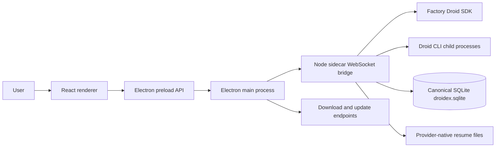

# Architecture

DROIDEX is split into three runtime surfaces: the React renderer, the Electron host, and the Node sidecar. Session list, restore, search, and transcript paging are served from one canonical SQLite database in the sidecar process.

## Runtime flow

## Components

| Area | Path | Responsibility |
| --- | --- | --- |
| Renderer | `src/` | React UI, local state, settings, onboarding, session and Mission Control views |
| Electron main | `electron/main.cjs` | Window lifecycle, bridge process management, native browser lifecycle, downloads, update checks |
| Electron preload | `electron/preload.cjs` | Narrow API boundary between renderer and Electron main process |
| Native browser preload | `electron/nativeBrowserPreload.cjs` | Browser automation bridge for embedded native browser flows |
| Sidecar | `sidecar/src/` | Local WebSocket bridge, provider session lifecycle, Mission Control integration, CLI discovery |
| Canonical database | `sidecar/src/persistence/` | `DroidexDatabase` owns the SQLite connection and schema. `SessionStore` owns summaries, private bindings, children, and restart state. `TranscriptStore` owns turns, canonical events, paging, and bounded search |

## Data and control boundaries

- The renderer does not call the Droid SDK directly. It communicates through preload APIs and the sidecar bridge.
- The Electron main process owns local process lifecycle and injects bridge configuration into the sidecar.
- The sidecar owns Droid SDK calls and child process environment shaping. It removes `FACTORY_API_KEY` unless a key is explicitly configured.
- Live canonical session state stays in the sidecar. `SessionStore` and `TranscriptStore` share one `DroidexDatabase` connection and persist on the sidecar event loop. There is no history-worker thread and no Factory JSONL import.
- Packaged builds require a bridge token. Development builds may allow local no-token access with `BRIDGE_ALLOW_LOCAL_NO_TOKEN=1`.

### Sidecar session core

- `appSessionId` is the stable top-level DROIDEX identity. `childSessionId` is the stable logical child identity within its `parentAppSessionId`. `providerSessionId` is the replaceable provider-native identity; it is private to the sidecar binding and never a renderer or bridge lookup key.
- `SessionManager` is the composition root and public command coordinator. It retains public dispatch, cross-module routing, and shutdown ordering.
- `FactoryRuntime` is the narrow SDK seam; `DroidRuntime` is its production adapter.
- `SessionRegistry` owns top-level sessions only: the live parent map, stable application identity, canonical parent summary persistence, and projected summary reads. Children never enter `SessionRegistry` or `sessions.list`.
- `sessions.list`, `session.loadHistory`, search, and markdown export read the canonical store plus live overlays. A session is durable from provisional create; DROIDEX does not wait on a provider transcript file before listing it.
- `ChildSessions` is the one stateful generic owner of parent-child membership, canonical child identity, provider replacement, admission, capacity, queues, turns, settings, cleanup, exact context/compaction targets, and child persistence/hydration.
- `MissionControlPolicy` owns only AGI Mission Control policy and projection: features, progress, worker/validator decisions, spawn correlation, Mission phase, and Mission completion. It may call `ChildSessions`; `ChildSessions` does not import Mission Control.
- `SessionTimeline` owns history listing and restore, child replay, status entries, and the canonical record-before-emit path for live transcript events.
- `SessionContext` owns context snapshots, polling, compaction generations, and usage carryover. Parent and child targets remain isolated by `appSessionId` or the exact `parentAppSessionId + childSessionId` pair.
- Task children keep the custom-agent label and the effective model/reasoning from that exact provider-session launch as separate metadata. The renderer never derives a child model from its label or parent session; stable child IDs remain available in row diagnostics when labels repeat.
- `SessionCompaction` owns compaction-limit policy, provider arming, automatic notification transitions and watchdogs, and live or historical manual compaction. Child automatic settlements validate the captured parent, runtime, turn, and configuration generations before publishing or mutating state.
- `SessionInteractions` owns permission and question correlation, equivalent-signature grants, and the Spec-to-Auto transition. After successful Registry unregister, Lifecycle calls `forgetSession()`, which discards module-owned state without resolving callbacks or emitting events. PR 4 introduces no deterministic shutdown settlement; that behavior remains deferred.
- `SessionEventFlow` owns stream and notification normalization, per-app/per-source terminal gating, and transcript-before-side-effect ordering. It has one callback into Manager for the coupled policy that remains there.
- `SessionLifecycle` owns primary-session create, resume, lazy resume, send queueing, steering, interruption, and ordered cleanup. Parent close calls one semantic `ChildSessions.closeParent()` operation rather than maintaining another child map.
- Workspace sessions pass their selected folder to Factory unchanged. Folder-less sessions remain `workspaceKind: none` in navigation, while their Factory runtime uses the app-owned `chats/` directory under `DROIDEX_USER_DATA_DIR`; DROIDEX creates it before opening the session and never uses the user's home directory as an implicit workspace.

### Child runtime residency

- Every live child runtime is a provider operating-system process. One measures roughly 350 MiB resident while doing nothing, so the four concurrently live child runtimes the budget allows are the largest single memory cost in the application.
- `childRuntimeBudget` decides admission and which idle runtime is evicted under pressure. `childRuntimeRetirement` decides when a runtime may be released with no pressure at all, and `ChildSessions` owns both timers and the close itself.
- A runtime is released after `CHILD_RUNTIME_IDLE_RETIREMENT_MS` (5 minutes) without use, and only once the child is fully settled: the parent no longer reports it running, no turn is streaming, nothing is queued or compacting, no interrupt or steer is in flight, no mutation is pending, no open attempt is outstanding, and the last result has reached history. A child doing work is never retired, however long its runtime has sat unused.
- Retirement closes the provider process only. The child, its persisted transcript, and its history survive. Opening it again paints history first and then reloads the provider session, and the child's transcript records why its runtime went away.
- The wake-up is a single timer armed for the earliest deadline and only while some runtime is actually retirable, so an app with nothing idle has no timer at all.

### Session runtime residency

- A top-level session's provider runtime is the same kind of operating-system process, roughly 355 MiB and 17 threads. A user working across several workspaces holds one per open session for the whole app run.
- `sessionRuntimeRetirement` decides when a session runtime may be released and owns the single wake-up timer; the release itself is the ordinary `SessionLifecycle` close, so the session, its persisted transcript, its history, and its sidebar row survive and the next prompt reloads the provider session.
- A session is released after `SESSION_RUNTIME_IDLE_RETIREMENT_MS` (30 minutes) measured from both its last reply and the moment the user last switched away from it, and only when it is fully settled: not on screen, no turn streaming, no unanswered plan or approval, nothing queued, compacting, interrupting, or steering, no child agent working, no embedded browser open, and no model choice still to reach the provider. The session the renderer reports as on screen is never released, and neither is a session hidden only because the window is minimized.
- Nothing is retirable until the renderer has reported which session is on screen, and the decision is taken again immediately before each close, so a prompt arriving while an earlier session is being released keeps the sessions behind it alive.
- Viewing a released session costs nothing: the transcript is served from persisted history in under 10 milliseconds regardless of its length, and only a prompt reloads the provider session, which measures about 0.7 seconds. The budget is six times the child budget despite that reload being the cheaper of the two, because of where the cost lands: a child pays behind its own loading state, a session pays after the user has typed a prompt and pressed enter.
- A sidecar restart applies the same rules before spending anything. `SessionAdoption` resurrects the sessions recorded in `live-runtime.json`, which spawns a provider process each, so it asks `sessionRuntimeRetirement` first and leaves any session already past the budget closed and reopenable rather than spawning a process for the first sweep to release. A restart takes every provider process, browser, and pending edit with it, so the journal records when each session was last active and adoption reads the exit phase and journalled child statuses alongside it. Sessions interrupted mid-turn, waiting on the user, or holding unsettled children are resurrected as before.

### Canonical session storage

- The sole application database is `$DROIDEX_USER_DATA_DIR/state/droidex.sqlite`. When that environment variable is unset, the default directory is `~/Library/Application Support/DROIDEX`. Electron may set `DROIDEX_USER_DATA_DIR` so a second local profile can run beside the main one.
- `PRAGMA user_version` is exactly `1`. The file uses WAL journal mode, foreign keys, and an exact match of tables, columns, indexes, and triggers. There is no schema migration and no compatibility reader.
- `DroidexDatabase` is the only connection owner and the only module that closes it. `SessionStore` persists summaries, immutable provider bindings, opaque resume state, children, lifecycle/failure, and restart state. `TranscriptStore` persists turns, canonical transcript events, bounded pages, and bounded search.
- `summary_json` holds non-authoritative display fields. Application identity, provider instance/kind, native binding, lifecycle/failure, generation, and timestamps are projected from normalized columns on read.
- Create allocates `appSessionId` and the first `turnId` before any provider await, then inserts the provisional row and turn in one transaction. Wire summaries pass through `projectWireSessionSummary`, which omits `providerSessionId` and previous native ids. The renderer addresses sessions only by `appSessionId` or `parentAppSessionId` + `childSessionId`.
- Provider-native files (`~/.factory/sessions` for Droid, and the equivalent native store for other adapters) exist only so that provider can resume. DROIDEX never imports, migrates, watches, or treats those files as application history. Factory `settings.json` remains a defaults reader; Task launch-settings reads stay inside the sessions root.
- Resume uses the stored opaque `resumeState` for the exact persisted instance. A missing binding, missing native history, or rejected native resume stays a visible failure. It never creates an empty replacement conversation and never falls back to a native-id lookup.
- Transcript pages default to 400 events and cap at 1,600. Older pages use an opaque `olderCursor`. Search scans at most 150 sessions, 40 MB of text, 25 result sessions, and three snippets per session, yields cooperatively, and reports `indexingIncomplete: false`. Markdown export reads at most 100,000 stored events for one chat.
- Workspace filtering keeps every canonical DROIDEX session for the requested folders. DROIDEX does not list Factory CLI chats that were never created in this app.
- Renderer localStorage snapshots use the `droid-session-snapshot-v2` key only. A valid v1 payload is ignored and left in place. Hydration requires one complete nested `configuration`; the sidecar `sessions.list` remains authoritative after paint.
- Shutdown closes children, then parents, then SQLite. A mismatched, corrupt, or non-WAL database fails fast with its path and the recovery action `move or remove this file, then restart DROIDEX`. Moving the file aside preserves it; DROIDEX does not delete it automatically.

### Renderer child navigation

- The left navigation and `sessions.list` contain parent sessions only.
- The active parent's canonical child summaries appear in the right context panel, including historical and same-role siblings.
- Selection, readiness, transcript filtering, settings, send, steer, Stop, and interrupt all resolve through one visible target keyed by `parentAppSessionId + childSessionId`.
- A provider runtime identity is never stored as a renderer child key. Historical or unavailable children remain selectable for transcript review while mutating actions stay disabled.

### Renderer transcript runtime

- The renderer store exposes one canonical array-shaped transcript per `appSessionId`, backed by immutable 128-event chunks. Streaming replaces only the bounded live chunk; settled chunks remain shared across store revisions, history slices, feed projection, snapshots, and inactive-session caching. The adapter is read-compatible with existing array consumers but rejects mutation.
- Each transcript runtime owns a persistent bucketed event-ID index, first-user pointer, latest child activity by source, and merged child-spawn index. Duplicate checks and child-panel derivations therefore do not scan retained history. Ordered bridge batches still preserve every non-transcript action as an ordering barrier.
- Each transcript write publishes a revision record with its prior revision, prior length, and first changed index. Exact older-page insertion publishes prepend provenance; history replacement, retained-window release, and any uncertain batch lineage publish a reset. Duplicate events do not advance the revision, and session removal prunes the transcript and its revision together.
- `ChatView` derives the visible primary or child transcript and grouped feed through a bounded projector. A proven append rebuilds only the earliest affected user turn, expanding backward when tool-call/result correlation crosses the boundary. Settled visible/feed chunks retain reference identity, and `MessageFeed` memoizes those chunks so a live token reconciles current rows rather than recreating every historical row element. Reset, missed revision, source-length mismatch, selection change, pending-state change, or feed-option change uses the canonical full builder.
- Mission Control visibility, spec-path discovery, timeline anchors, final-response markers, entrance keys, and child-session panels consume the same mutation lineage or runtime indexes. Normal live-tail updates inspect only the changed suffix/current turn; older-history prepends may deliberately process the inserted page while retaining the existing suffix chunks and viewport row identities.
- Child or sibling output that is invisible to the selected conversation advances provenance without replacing the visible transcript or feed references. Agent execution, event ingestion, persistence, settlement, and child supervision always continue for inactive or obscured conversations; only derived renderer work is reused.
- The projector keeps at most two inactive feed projections and only when both the complete session transcript and selected transcript contain at most 1,600 events and the retained transcript payload remains below the store's high-water budget. Larger histories remain cacheable only while active and are released from the projector on navigation. Conversation scroll snapshots restore by stable feed-row tail identity, so history prepends and warm switches preserve the reader's anchor without changing row keys.

### Autonomy

- The canonical levels are `off`, `low`, `medium`, and `high`, shared verbatim by the renderer, the bridge protocol, and the sidecar.
- Every `session.create` carries a complete nested `configuration`. The sidecar fails fast when it is missing instead of falling back to provider or factory defaults.
- The application default (Medium on first run) is persisted by the renderer and edited only in Settings → Configuration. The composer drafts a per-session override from that default; the draft resets whenever the create target changes.
- Starting a Mission requires High autonomy. The composer blocks a lower draft behind an explicit choice to raise it; autonomy is never elevated silently.
- Live changes replace the nested `configuration` through `session.updateSettings`. The renderer shows a pending state and settles when the confirmed summary arrives. Native Droid settings are applied immediately before the next accepted turn, never during the update command. Rejections and native apply failures surface as recoverable `session.configuration_update_failed` errors, and a settlement that lands after close or provider replacement is discarded.
- Child sessions report their confirmed effective autonomy only while their runtime is live. It is read from the provider init result, never persisted, and never inherited from the parent; historical or unopened children report none and the renderer labels them provider managed.

## Performance instrumentation

Perf phase 0 (#116) instruments the full event path — provider event →
normalized → persisted → transport → renderer receive → store commit → next
paint — and provides a deterministic replay harness for validating every later
performance change.

### Sidecar hot-path metrics

- `sidecar/src/telemetry/hotPathMetrics.ts` records always-on stage
  histograms (`normalize`, SQLite `persist`, `emit` dispatch, `transport`
  fan-out, coalesced-delta batch sizes), transport byte rates, event-loop
  delay, process CPU/memory, and resource gauges (live sessions, child
  agents).
- `sidecar/src/bridgeServer.ts` owns the authenticated WebSocket fan-out and
  the token-gated HTTP routes. `GET /perf/metrics?token=<BRIDGE_TOKEN>`
  returns the current snapshot as JSON for live diagnosis and for the harness.
- The sidecar entry (`sidecar/src/index.ts`) enables the collector at
  readiness and samples `SessionManager.resourceCounts()` for the gauges.

### Ordered bridge transport

The sidecar assigns process-generation sequence numbers at the single outbound
bridge boundary and groups ordinary events into short bounded batches. Only
replaceable session/context telemetry can collapse, and never across a
non-replaceable event. Approvals, questions, errors, lifecycle boundaries,
history responses, and turn settlement flush immediately.

Renderers must advertise bridge protocol 3, apply one wire batch as one
ordered store transition, and reconnect with the last fully applied generation
and sequence. Same-generation reconnects replay the retained buffer. A new
process generation or a replay gap delivers a compact `bridge.snapshot` of
live sessions and runtime state instead of a hard resync; `bridge.reset` is
reserved for an invalid resume cursor. Electron owns sidecar health
(`starting`, `healthy`, `degraded`, `restarting`, `recovery-required`,
`stopped`) and bounded restart; `GET /health` is a cheap liveness probe, not a
death signal while the process is still alive. A missed or slow `/health`
while the child is still running is `degraded`; only a real process `exit`
restarts. The probe does not sample event-loop delay. Production leaves the
10 ms histogram off; support can arm it for the rest of that sidecar process
with `GET /perf/metrics?token=…&eventLoop=1`. Clients using another protocol
version are rejected instead of entering a compatibility path. The sidecar
retains a bounded same-process replay window and terminates clients whose
socket buffers cross the hard ceiling.

### Renderer metrics

- `src/lib/rendererPerf.ts` measures bridge receive → store commit → next
  paint per event batch, the age of `event.appended` messages at socket read,
  long tasks (`PerformanceObserver`), the mounted grouped feed-row count
  (reported by the feed), and full, incremental, cached,
  or invisible feed projection work with rebuilt/reused event totals.
- The snapshot is available in the console via
  `window.__droidexPerf.getSnapshot()`.

### Conversation find and range copy

Virtualized conversation rows are not a searchable or selectable document.
In-conversation find (Cmd/Ctrl+F) and range copy read retained feed state, then
scroll with `ConversationListHandle.scrollToRow`. Match counts say "in loaded
history" when older pages remain on disk, and find offers to load them instead
of reporting a silent miss. Find does not raise overscan or remount the
transcript.

### Electron main gauges

- `electron/performanceMetrics.cjs` collects live WebContents, live PTYs, and
  process memory/CPU; the renderer reads it through
  `window.droidControl.getPerformanceMetrics()`.

### Replay harness

`npm run perf:replay -- --scenario <name>` boots the real sidecar pipeline
(SessionManager, SessionEventFlow, SessionTimeline, canonical SQLite, bridge
WebSocket) against a scripted provider and writes JSON + Markdown artifacts
to `reports/perf/`. Headless scenarios: `smoke`, `idle`, `streaming`,
`multi-agent`, `agents-4`, `agents-16`, `agents-27`, `long-history`,
`long-tail`, `session-switch`, `soak`. Browser/design workspace, hidden-window
CPU, and sidecar-restart are documented skips (restart belongs to the
supervision phase).

A/B probes (`npm run perf:compare` / `npm run perf:report`) measure the same
self-contained metrics on a baseline git worktree and on this tree. Metrics
that need phase-0/1/4 code are labelled **candidate-only** and never get a
fabricated baseline. `npm run perf:gates` / `npm run quality:perf-gates` fail
on bounded mounted rows, bounded queues, marker loss, soak leaks, terminal
delivery amplification, and feed rebuild counts. Timing CPU/RSS is recorded
and warned, not failed, on shared runners. Bundle bytes stay gated by
`npm run quality:bundle-budgets`. Release numbers live in
`docs/performance-budgets.md`.

## Build path

`npm run build` runs frontend typecheck and Vite build, builds the sidecar bundle, and syntax-checks Electron CommonJS entrypoints. The sidecar build emits `sidecar/dist/sidecar.mjs`. Electron uses that entry unless `SIDECAR_ENTRY` is set and packages `sidecar/dist` from the build.

## Update path

Free, ad-hoc-signed macOS builds use Sparkle against architecture-specific,
EdDSA-signed appcasts and ZIPs in the public
`droidex-anas/droidex-releases` repository. DROIDEX may check for a new
version in the background, but download and installation always require an
explicit user action. The future Developer ID path uses `electron-updater` and
`latest-mac.yml`. The source repository is never a client update feed.
