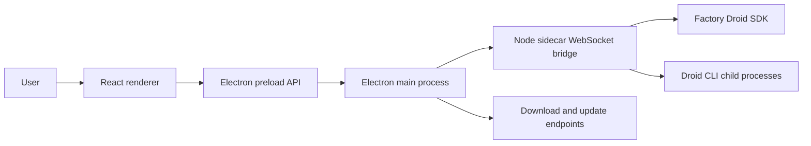

# Architecture

DROIDEX is split into three runtime surfaces: the React renderer, the Electron host, and the Node sidecar.

## Runtime flow

## Components

| Area | Path | Responsibility |
| --- | --- | --- |
| Renderer | `src/` | React UI, local state, settings, onboarding, session and Mission Control views |
| Electron main | `electron/main.cjs` | Window lifecycle, bridge process management, native browser lifecycle, downloads, update checks |
| Electron preload | `electron/preload.cjs` | Narrow API boundary between renderer and Electron main process |
| Native browser preload | `electron/nativeBrowserPreload.cjs` | Browser automation bridge for embedded native browser flows |
| Sidecar | `sidecar/src/` | Local WebSocket bridge, Droid SDK session lifecycle, Mission Control integration, CLI discovery |

## Data and control boundaries

- The renderer does not call the Droid SDK directly. It communicates through preload APIs and the sidecar bridge.
- The Electron main process owns local process lifecycle and injects bridge configuration into the sidecar.
- The sidecar owns Droid SDK calls and child process environment shaping. It removes `FACTORY_API_KEY` unless a key is explicitly configured.
- Packaged builds require a bridge token. Development builds may allow local no-token access with `BRIDGE_ALLOW_LOCAL_NO_TOKEN=1`.

### Sidecar session core

- `appSessionId` is the stable top-level application identity. `childSessionId` is the stable logical child identity within its `parentAppSessionId`; `providerSessionId` is reserved for the backing Factory session.
- `SessionManager` is the composition root and public command coordinator. It retains public dispatch, cross-module routing, and shutdown ordering.
- `FactoryRuntime` is the narrow SDK seam; `DroidRuntime` is its production adapter.
- `SessionRegistry` owns top-level sessions only: the live parent map, stable application identity, provider aliases, canonical parent summary persistence, and projected summary reads. Children never enter `SessionRegistry` or `sessions.list`.
- Ordinary chats enter durable `sessions.list` history only after the provider file contains both a user message and an assistant response. In-progress first turns remain visible through the live registry; abandoned or unanswered provider files never become permanent sidebar rows.
- `ChildSessions` is the one stateful generic owner of parent-child membership, canonical child identity, provider replacement, admission, capacity, queues, turns, settings, cleanup, exact context/compaction targets, and child persistence/hydration.
- `MissionControlPolicy` owns only AGI Mission Control policy and projection: features, progress, worker/validator decisions, spawn correlation, Mission phase, and Mission completion. It may call `ChildSessions`; `ChildSessions` does not import Mission Control.
- `SessionTimeline` owns history listing and restore, child replay, status entries, and the canonical record-before-emit path for live transcript events.
- `SessionContext` owns context snapshots, polling, compaction generations, and usage carryover. Parent and child targets remain isolated by `appSessionId` or the exact `parentAppSessionId + childSessionId` pair.
- Task children keep the custom-agent label and the effective model/reasoning from that exact provider-session launch as separate metadata. The renderer never derives a child model from its label or parent session; stable child IDs remain available in row diagnostics when labels repeat.
- `SessionCompaction` owns compaction-limit policy, provider arming, automatic notification transitions and watchdogs, and live or historical manual compaction. Child automatic settlements validate the captured parent, runtime, turn, and configuration generations before publishing or mutating state.
- `SessionInteractions` owns permission and question correlation, equivalent-signature grants, and the Spec-to-Auto transition. After successful Registry unregister, Lifecycle calls `forgetSession()`, which discards module-owned state without resolving callbacks or emitting events. PR 4 introduces no deterministic shutdown settlement; that behavior remains deferred.
- `SessionEventFlow` owns stream and notification normalization, per-app/per-source terminal gating, and transcript-before-side-effect ordering. It has one callback into Manager for the coupled policy that remains there.
- `SessionLifecycle` owns primary-session create, resume, lazy resume, send queueing, steering, interruption, and ordered cleanup. Parent close calls one semantic `ChildSessions.closeParent()` operation rather than maintaining another child map.
- Workspace sessions pass their selected folder to Factory unchanged. Folder-less sessions remain `workspaceKind: none` in navigation, while their Factory runtime uses the app-owned `chats/` directory under `DROIDEX_USER_DATA_DIR`; DROIDEX creates it before opening the session and never uses the user's home directory as an implicit workspace.

### Renderer child navigation

- The left navigation and `sessions.list` contain parent sessions only.
- The active parent's canonical child summaries appear in the right context panel, including historical and same-role siblings.
- Selection, readiness, transcript filtering, settings, send, steer, Stop, and interrupt all resolve through one visible target keyed by `parentAppSessionId + childSessionId`.
- A provider runtime identity is never stored as a renderer child key. Historical or unavailable children remain selectable for transcript review while mutating actions stay disabled.

### In-chat App blocks

- A fenced `app` block in an assistant message is persisted as ordinary transcript text. The renderer remains the only owner of its temporary idle/running state, so restored chats always reopen with the block inert.
- A completed App opens automatically for its first response and stays open across the live-to-history settlement handoff. Reopening the chat shows a compact **Play** card; manual playback reveals the measured canvas in the current viewport, and **Stop** unmounts the iframe and releases its timers and browser resources.
- The sandbox is transparent and flows at its reported intrinsic height on the chat canvas. It supplies DROIDEX colors as `--app-background`, `--app-surface`, `--app-foreground`, `--app-muted`, `--app-border`, and `--app-accent`.
- `/visualize` stays concise in the transcript. The sidecar adds the private, provider-facing App contract and strips it back to the user's command when history is replayed. Once a visible conversation contains an App, ordinary follow-up prompts retain a private revision contract so the model can fix or replace that App without another slash command.
- App blocks are self-contained. Their content security policy blocks network connections, nested frames, objects, forms, and external resources. Generated content is disabled entirely in file previews, fetched web content, and pull-request comments.

### Autonomy

- The canonical levels are `off`, `low`, `medium`, and `high`, shared verbatim by the renderer, the bridge protocol, and the sidecar.
- Every `session.create` carries an explicit autonomy snapshot. The sidecar fails fast when it is missing instead of falling back to provider or factory defaults.
- The application default (Medium on first run) is persisted by the renderer and edited only in Settings → Configuration. The composer drafts a per-session override from that default; the draft resets whenever the create target changes.
- Starting a Mission requires High autonomy. The composer blocks a lower draft behind an explicit choice to raise it; autonomy is never elevated silently.
- Live changes go provider-first through `session.updateSettings`, serialized per session. The renderer shows a pending state and settles only when the confirmed summary arrives; rejections surface as recoverable `session.autonomy_update_failed` errors, and a settlement that lands after close or provider replacement is discarded.
- Child sessions report their confirmed effective autonomy only while their runtime is live. It is read from the provider init result, never persisted, and never inherited from the parent; historical or unopened children report none and the renderer labels them provider managed.

## Build path

`npm run build` runs frontend typecheck and Vite build, builds the sidecar bundle, and syntax-checks Electron CommonJS entrypoints. The sidecar build emits `sidecar/dist/sidecar.mjs`, which Electron uses unless `SIDECAR_ENTRY` is set.

## Update path

Free, ad-hoc-signed macOS builds use Sparkle against architecture-specific,
EdDSA-signed appcasts and ZIPs in the public
`droidex-anas/droidex-releases` repository. DROIDEX may check for a new
version in the background, but download and installation always require an
explicit user action. The future Developer ID path uses `electron-updater` and
`latest-mac.yml`. The source repository is never a client update feed.
