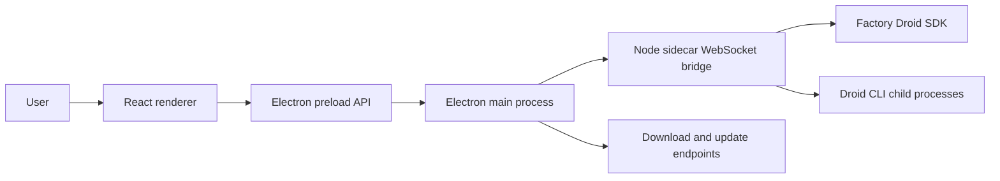

# Architecture

DROIDEX is split into three runtime surfaces: the React renderer, the Electron host, and the Node sidecar.

## Runtime flow

## Components

| Area | Path | Responsibility |
| --- | --- | --- |
| Renderer | `src/` | React UI, local state, settings, onboarding, session and Mission Control views |
| Electron main | `electron/main.cjs` | Window lifecycle, bridge process management, native browser lifecycle, downloads, update checks |
| Electron preload | `electron/preload.cjs` | Narrow API boundary between renderer and Electron main process |
| Native browser preload | `electron/nativeBrowserPreload.cjs` | Browser automation bridge for embedded native browser flows |
| Sidecar | `sidecar/src/` | Local WebSocket bridge, Droid SDK session lifecycle, Mission Control integration, CLI discovery |

## Data and control boundaries

- The renderer does not call the Droid SDK directly. It communicates through preload APIs and the sidecar bridge.
- The Electron main process owns local process lifecycle and injects bridge configuration into the sidecar.
- The sidecar owns Droid SDK calls and child process environment shaping. It removes `FACTORY_API_KEY` unless a key is explicitly configured.
- Packaged builds require a bridge token. Development builds may allow local no-token access with `BRIDGE_ALLOW_LOCAL_NO_TOKEN=1`.

### Native browser boundary

- Electron owns one persistent `persist:droidex-browser` partition shared by the built-in browser across DROIDEX chats. Sidecar browser sessions retain separate `appSessionId` and `browserSessionId` identities for routing and lifecycle; they do not own separate cookie profiles. Each task's view stays alive in the hidden native host when another chat is visible, so background browser work does not replace the active task's pane.
- Agent-supplied navigation accepts only external `http:` and `https:` URLs. `about:blank` is reserved for the internal initial state. Local files, executable `javascript:` or `data:` URLs, browser-internal pages, embedded URL credentials, and custom schemes are rejected before native navigation.
- Every native browser result is correlated by `requestId`, `appSessionId`, and `browserSessionId`. Actions for one managed browser are serialized. Close invalidates active and queued work before native cleanup; a replacement receives a fresh browser identity, so late results cannot update or reuse it.
- Settings → Browser is the user-owned policy surface. The Electron main process validates the full `requestId + appSessionId + browserSessionId + action + autonomy` request and executes it as one transaction. “Follow autonomy” resolves High to full safe-site access, Medium to exact-origin approval for new sites, and Low/Off to per-opening approval. The reserved first-party `droidex-browser` MCP server defers its generic SDK confirmation to this resource-owner policy, avoiding a second broad prompt on every hover or click. Direct address-bar, reload, and viewport actions retain explicit user provenance; agent redirects and delayed navigations remain main-process gated. Inspect, network, and console diagnostics stay behind a separate switch that is off by default; agents never receive raw CDP access.
- Cookie import is main-process owned. On macOS, Electron discovers Chrome profiles, asks in DROIDEX before invoking the fixed Keychain lookup for Chrome Safe Storage, opens the current cookie database read-only, validates Chromium v24 host hashes and cookie fields, and retains values only in an opaque, expiring, single-use plan. The renderer receives a random plan ID plus domain/count/replacement metadata. Bounded JSON/Netscape files are accepted only as Chrome recovery. Commit closes all native browser views before mutating the shared cookie store and flushes completed writes before the user reopens a site. After a successful or partial commit, browser settings persist only a receipt timestamp, Chrome method/profile label, and aggregate imported/replacement/skipped/failed/domain counts; domains, cookie names, values, and file paths are excluded by schema. Import remains cookie-only and deliberately skips partitioned cookies that Electron cannot represent; it does not clone local storage, service workers, device-bound state, or the rest of a Chrome profile. Safari live-session import is intentionally unavailable because Safari exposes no supported cookie-transfer API, so Safari accounts are signed in directly inside DROIDEX without a file picker or Full Disk Access request. No path imports browser passwords, and cookie values never cross into the React renderer or sidecar agent.
- Credentials are captured only from the known main frame of a native browser page after the user submits an unambiguous current-password or new-password form and accepts a save prompt. Electron encrypts and decrypts the credential through non-blocking operating-system protected storage (macOS Keychain on macOS), keys it by exact HTTPS origin (with an explicit loopback development exception), and revalidates the owning view, live contents, and origin before save or fill. An expected same-view navigation within the submitted origin does not discard the capture; replacement, destruction, or an origin change does. Every agent fill requires native approval by default; when macOS exposes Touch ID, DROIDEX asks for it immediately before decrypting and injecting. Plaintext credentials are never returned to the renderer or agent.
- Agent-triggered signup, sign-in, OAuth, and detected passkey actions require a single-use native approval before the click or submit is sent. Cross-origin iframe authentication fails closed at every autonomy level. OAuth can mint one short-lived, one-use capability only when the exact inspected provider destination is authoritatively known; a different or unresolved popup target is denied. Passkey actions never mint a web-popup capability. The sandboxed OAuth child shares the DROIDEX partition for provider compatibility, retains its opener relationship, blocks unsafe schemes and further popups, and is not connected to the agent automation bridge.
- On supported Electron/macOS releases, WebAuthn account selection is owned by the main process and cancels by default. The native prompt receives only sanitized account labels, while credential IDs remain in main-process memory and only the chosen opaque ID is returned to Chromium. Touch ID WebAuthn is configured only for packaged Developer ID releases carrying the concrete `${APPLE_TEAM_ID}.app.droidex.webauthn` keychain access group. Release packaging fails when that Team ID is absent or malformed; development and ad-hoc packages report Touch ID passkeys as unavailable. These passkeys are device-bound, and DROIDEX does not claim iCloud Passwords synchronization.
- Arbitrary remote pages run with Chromium sandboxing, context isolation, and Node integration disabled. Agent-facing URLs redact OAuth codes, state, nonce, SAML assertions, tickets, fragments, and other token-like parameters. Screenshot capture masks password and one-time-code inputs. A remote page cannot settle an agent request; only the authoritative main-process invoke result can.
- Camera and microphone are blocked by default. Ask mode routes the exact top-level origin and media types through a correlated, abortable DROIDEX prompt. Allow once lasts for the current document; Block once denies only the current request. Always-allow and always-block decisions are persisted per exact origin and media type and remain revocable in Settings. The permission check handler denies before a valid grant exists. macOS TCC remains the final required system boundary. USB, HID, serial, and other device permissions remain denied. Downloads show a save dialog by default; automatic paths are constrained to the configured download directory with sanitized, non-overwriting names.
- The optional DROIDEX agent cursor is a sandboxed, transparent, click-through child window positioned above the native browser at the isolated preload's resolved click, hover, and scroll coordinates. The default is a crisp curved pointer with a soft blue activity halo and native eased movement between consecutive live points; light and dark treatments plus a bounded 24–64 px size control are available in Settings. Its native hotspot scales with the artwork so the visible tip remains the actual input point. A visible native pointer action is refused unless the overlay can represent the same in-bounds point. Remote pages cannot call, remove, or hide the native overlay (although page content can imitate cursor artwork, so the indicator is telemetry rather than an authentication signal). Navigation, background parking, disabling the setting, and a short expiry detach or hide stale cursor state. Only the active task's pane displays it; background task views continue independently in the hidden native host.
- The live native `WebContents` URL is authoritative. Manual navigations publish into renderer state, `snapshot` observes without navigating, and tool guidance forbids reopening conversation-memory URLs for current-page inspection. Reload prefers a valid live URL, then the last valid failed/loading/target URL, then the configured home page; `about:blank` and Chromium error documents never replace recoverable page state.
- Clearing browser data closes native browser views, then removes cookies, cache, local storage, IndexedDB, service workers, cache storage, and HTTP authentication state from the shared partition. Saved DROIDEX logins are managed separately and can be deleted per origin.

### Sidecar session core

- `appSessionId` is the stable top-level application identity. `childSessionId` is the stable logical child identity within its `parentAppSessionId`; `providerSessionId` is reserved for the backing Factory session.
- `SessionManager` is the composition root and public command coordinator. It retains public dispatch, cross-module routing, and shutdown ordering.
- `FactoryRuntime` is the narrow SDK seam; `DroidRuntime` is its production adapter.
- `SessionRegistry` owns top-level sessions only: the live parent map, stable application identity, provider aliases, canonical parent summary persistence, and projected summary reads. Children never enter `SessionRegistry` or `sessions.list`.
- Ordinary chats enter durable `sessions.list` history only after the provider file contains both a user message and an assistant response. In-progress first turns remain visible through the live registry; abandoned or unanswered provider files never become permanent sidebar rows.
- `ChildSessions` is the one stateful generic owner of parent-child membership, canonical child identity, provider replacement, admission, capacity, queues, turns, settings, cleanup, exact context/compaction targets, and child persistence/hydration.
- `MissionControlPolicy` owns only AGI Mission Control policy and projection: features, progress, worker/validator decisions, spawn correlation, Mission phase, and Mission completion. It may call `ChildSessions`; `ChildSessions` does not import Mission Control.
- `SessionTimeline` owns history listing and restore, child replay, status entries, and the canonical record-before-emit path for live transcript events.
- `SessionContext` owns context snapshots, polling, compaction generations, and usage carryover. Parent and child targets remain isolated by `appSessionId` or the exact `parentAppSessionId + childSessionId` pair.
- Task children keep the custom-agent label and the effective model/reasoning from that exact provider-session launch as separate metadata. The renderer never derives a child model from its label or parent session; stable child IDs remain available in row diagnostics when labels repeat.
- `SessionCompaction` owns compaction-limit policy, provider arming, automatic notification transitions and watchdogs, and live or historical manual compaction. Child automatic settlements validate the captured parent, runtime, turn, and configuration generations before publishing or mutating state.
- `SessionInteractions` owns permission and question correlation, equivalent-signature grants, and the Spec-to-Auto transition. After successful Registry unregister, Lifecycle calls `forgetSession()`, which discards module-owned state without resolving callbacks or emitting events. PR 4 introduces no deterministic shutdown settlement; that behavior remains deferred.
- `SessionEventFlow` owns stream and notification normalization, per-app/per-source terminal gating, and transcript-before-side-effect ordering. It has one callback into Manager for the coupled policy that remains there.
- `SessionLifecycle` owns primary-session create, resume, lazy resume, send queueing, steering, interruption, and ordered cleanup. Parent close calls one semantic `ChildSessions.closeParent()` operation rather than maintaining another child map.
- Workspace sessions pass their selected folder to Factory unchanged. Folder-less sessions remain `workspaceKind: none` in navigation, while their Factory runtime uses the app-owned `chats/` directory under `DROIDEX_USER_DATA_DIR`; DROIDEX creates it before opening the session and never uses the user's home directory as an implicit workspace.

### Renderer child navigation

- The left navigation and `sessions.list` contain parent sessions only.
- The active parent's canonical child summaries appear in the right context panel, including historical and same-role siblings.
- Selection, readiness, transcript filtering, settings, send, steer, Stop, and interrupt all resolve through one visible target keyed by `parentAppSessionId + childSessionId`.
- A provider runtime identity is never stored as a renderer child key. Historical or unavailable children remain selectable for transcript review while mutating actions stay disabled.

### Autonomy

- The canonical levels are `off`, `low`, `medium`, and `high`, shared verbatim by the renderer, the bridge protocol, and the sidecar.
- Every `session.create` carries an explicit autonomy snapshot. The sidecar fails fast when it is missing instead of falling back to provider or factory defaults.
- The application default (Medium on first run) is persisted by the renderer and edited only in Settings → Configuration. The composer drafts a per-session override from that default; the draft resets whenever the create target changes.
- Starting a Mission requires High autonomy. The composer blocks a lower draft behind an explicit choice to raise it; autonomy is never elevated silently.
- Live changes go provider-first through `session.updateSettings`, serialized per session. The renderer shows a pending state and settles only when the confirmed summary arrives; rejections surface as recoverable `session.autonomy_update_failed` errors, and a settlement that lands after close or provider replacement is discarded.
- Child sessions report their confirmed effective autonomy only while their runtime is live. It is read from the provider init result, never persisted, and never inherited from the parent; historical or unopened children report none and the renderer labels them provider managed.

## Build path

`npm run build` runs frontend typecheck and Vite build, builds the sidecar bundle, and syntax-checks Electron CommonJS entrypoints. The sidecar build emits `sidecar/dist/sidecar.mjs`, which Electron uses unless `SIDECAR_ENTRY` is set.

## Update path

Free, ad-hoc-signed macOS builds use Sparkle against architecture-specific,
EdDSA-signed appcasts and ZIPs in the public
`droidex-anas/droidex-releases` repository. DROIDEX may check for a new
version in the background, but download and installation always require an
explicit user action. The future Developer ID path uses `electron-updater` and
`latest-mac.yml`. The source repository is never a client update feed.
